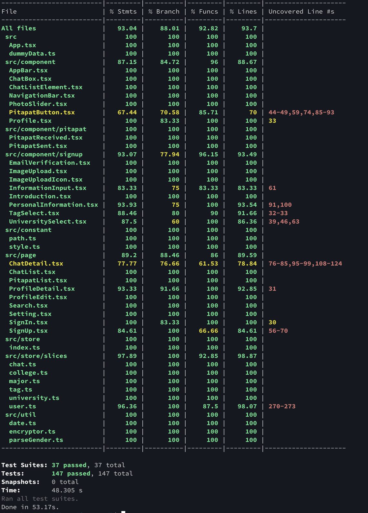
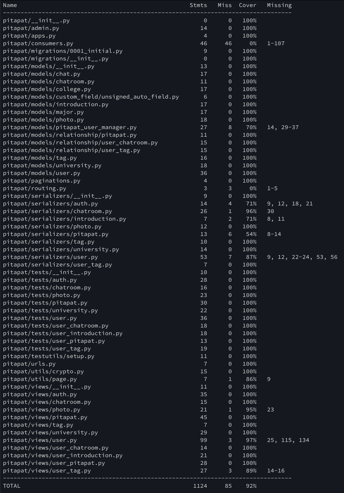

# Pitapat Campus: Sprint #4 Backlog

## Revised Documentations

### Requirements and Specification

Search page user interface including tag filtering is added.

### Design and Planning

Backend API list and data formats are updated according to the real implementation.

## Implementations

### Frontend

Until Sprint 3, frontend temporarily used `localStorage` to mock server; since backend server is constructed now, these temporary implementations in components, pages, Redux stores, and tests are all modified. Some features (ex. email verification) are moved to backend.

In  `ChatDetail` page, WebSocket is used to provide chatting feature.

#### Pages / Components Modified

- `SignIn`
- `SignUp`
  - `UniversitySelect`
  - `EmailVerification`
  - `PersonalInformation`
  - `ImageUpload`
- `Search`
  - `Profile`
    - `PitapatButton`
- `ProfileDetail`
- `PitapatList`
  - `PitapatReceived`
  - `PitapatSent`
- `ChatList`
  - `ChatListElement`
- `ChatDetail`
  - `ChatBox`
- `Setting`

#### Redux Stores Modified

- `user`
- `university`
- `college`
- `major`
- `tag`
- `chat`

### Backend

#### HTTP API

All required APIs corresponding to frontend features are implemented:

- `/auth/`
  - `/auth/email/` [POST]
  - `/auth/verify/` [POST]
  - `/auth/login/` [POST]
  - `/auth/logout/` [POST]
- `/user/`
  - `/user/` [GET, POST]
  - `/user/<int:user_key>/` [GET, PUT, DELETE]
  - `/user/<int:user_key>/chatroom/` [GET]
  - `/user/<int:user_key>/introduciton/` [PUT]
  - `/user/<int:user_key>/pitapat/from/` [GET]
  - `/user/<int:user_key>/pitapat/to/` [GET]
  - `/user/<int:user_key>/tag/` [POST, DELETE]
- `/university/`
  - `/university/` [GET]
- `/college/`
  - `/college/university/<int:university_key>/` [GET]
- `/major/`
  - `/major/college/<int:college_key>/` [GET]
- `/tag/`
  - `/tag/` [GET]
- `/photo/`
  - `/photo/user/<int:user_key>/` [POST]
  - `/photo/<int:photo_key>/` [GET, DELETE]
- `/pitapat/`
  - `pitapat` [POST, DELETE]
- `/chatroom/`
  - `/chatroom/<int:chatroom_key>/user/` [GET]

#### WS API

Chatting is implemented using WebSocket communication.

- `/ws/chat/<int:chatroom:key>/` [CONNECT, DISCONNECT, RECEIVE]

## Test Coverage

### Frontend

### Backend

## Contributions

### Sprint 3

- 김혜인
  - frontend feature: profile detail page, setting page
  - frontend testing: profile detail page, setting page, common components
  - CI setting
  - documentation
- 우승석
  - frontend feature: chat list page, chat detail page, common components
  - frontend testing: chat list page, chat detail page, common components
- 최문원
  - frontend feature: search page, pitapat list page
  - frontend testing: search page, pitapat list page
  - mid-presentation
- 최성우
  - frontend feature: sign in, sign up page
  - frontend testing: sign in, sign up page

### Sprint 4

- 김혜인
  - DB connection
  - backend feature: login/logout, user list filtering, user CRUD, photo, pitapat, chat
  - frontend-backend communication: sign up, pitapat button, chat
  - frontend testing: email verification
  - documentation
- 우승석
  - DB setting & table design
  - AWS S3 setting
  - backend feature: pitapat, introduction, chat
  - frontend-backend communication: Redux stores, signin, search, pitapat list
  - frontend testing: chat list element, email verification
- 최문원
  - backend feature: university, college, major, chatroom
  - frontend testing: Redux stores, sign up, sign in, profile detail, chat list, chat detail
- 최성우
  - backend feature: email verification, pitapat, tag
  - backend testing: email verification, university, user, introduction, photo, tag, pitapat, chatroom

## Current Progress

| Todos                             | Sub-items                                                    |       Status       |
| :-------------------------------- | :----------------------------------------------------------- | :----------------: |
| **Requirement and Specification** | Market Analysis, User Stories, User Interface                |        DONE        |
| **MVC Design**                    | Model-View-Controller Design                                 |        DONE        |
| **Frontend Design**               | Pages Diagram, Components Diagram                            |        DONE        |
| **Backend Design**                | API Table, HTTP Data Format                                  |        DONE        |
| **Frontend Development**          | Sign In, Sign Up, Search (with filtering), Profile Detail, Pitapat List, Chat List, Chat Detail, Setting |        DONE        |
| **Frontend Development**          | Profile Edit                                                 |      ONGOING       |
| **Frontend Testing**              | Component/Page Unit Tests                                    |      ONGOING       |
| **Backend Development**           | Database construction, Model/View Implementation, Image Storing via AWS S3 |        DONE        |
| **Backend Testing**               | View Unit Tests                                              |      ONGOING       |
| **Additional Features**           | Blocking Unwanted Users, Payment System                      | PLANNED (Sprint 5) |
| **Deployment**                    | Deployment via AWS EC2                                       | PLANNED (Sprint 5) |