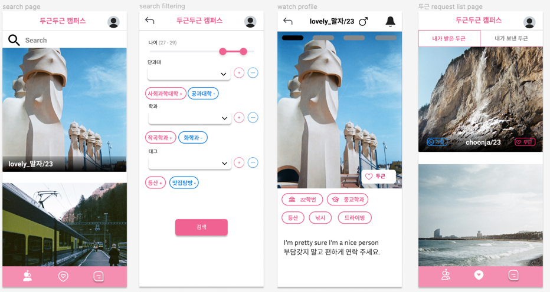

# Pitapat Campus: Sprint #2 Backlog

## Updated Features

### User Stories

Seeing sent requests is added to user stories.

#### Seeing the List of Pitapats Sent to Others

- actor: a user who sent pitapats to others.
- precondition: A User has sent pitapats to other users.
- trigger: The user presses a pitapat icon on the navigation bar and clicks  the 'pitapats sent list' tab.
- scenarios
  - The list of Pitapats sent to others contains the receiver’s basic information such as a nickname, main profile image, and age.
  - The user can see the profile detail of the sender by clicking the receiver’s main profile image.
  - The user can cancel a pitapat by clicking the pitapat button which is already toggled on.
- postconditions
  - After canceling a pitapat, the received user's profile is removed from the list.
- acceptance tests:
  - (1)
    - given: after sending Pitapats to others
    - when: when the user checks a sent Pitapat and presses the pitapat button to cancel
    - then: a received user is removed from the list, and the user is removed from the received pitapats list of the other user who just got canceled

### User Interface Requirements

Several changes on user interface requirements. The profile button got removed from the navigation bar and now it is at the top right corner. On the list of pitapats page, there are two tabs. One is the 'list of pitapats received' and the other is the 'list of pitapats sent'.

#### Search Page & Profile Detail Page & Pitapat List Page

#### Chat List Page & Chat Room Page

#### Profile Setting Page

