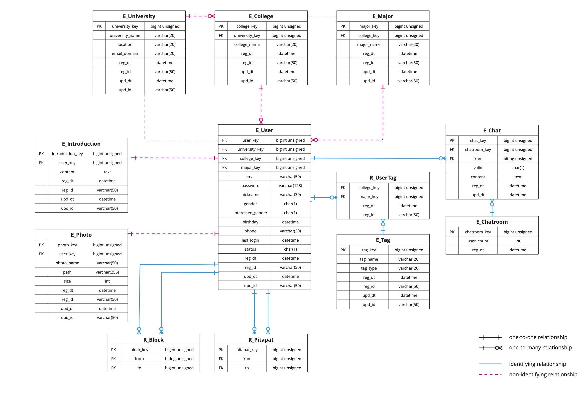

# Pitapat Campus: Design and Planning

Rev. 1.0, 10/28/2022

## System Architecture

### MVC Design Pattern

*Pipapat Campus* uses the Model-View-Controller design pattern in system architecture. The frontend contains 8 views, the backend has 6 models, and the controller connects the frontend and the backend.


### Model

#### E-R Diagram

Each table represents an entity or a relationship between entities. Entity tables and relationship tables are distinguished by their prefixes: `E_` and `R_`.

A Line between two tables shows their relationship. Its relationship type is denoted as arrow shape and line color; these symbols are explained below the figure.



#### Entity Description

| Model            | Description                                                                                                                                   |
|------------------|-----------------------------------------------------------------------------------------------------------------------------------------------|
| **University**   | A closed community that only users in the same university can see each other.                                                                 |
| **College**      | Each university has a number of colleges.                                                                                                     |
| **Major**        | Each college in a university has a number of majors. Used as a user's tag.                                                                    |
| **User**         | The user that belongs to a university. Has its own introduction, photos, and tags. Can see profiles of other users and send pitapats to them. |
| **Introduction** | Self-introduce text written by a user.                       |
| **Photo**        | Photos showing a user's appearance.                          |
| **Tag**          | Additional keywords that a user adds to appeal itself.       |
| **Pitapat**      | A request for matching from a user to another user.          |
| **Blocked**      | A request for blocking from a user to another user.          |

### View

The image below is the user interface for view design.

#### UI Flow


The functionality and the requirement for each page are described below.

#### Sign In Page (`/signin/`)

- Get 'e-mail' and 'password' and check whether the user is a member. After logging in, navigate to the main page.
- First visitors should click the sign-up button and make an account. Should navigate to the sign-up page.

#### Sign Up Page (`/signup/`)

- Get university information and e-mail address.
- Certify the user's university by receiving the code which is sent to the e-mail address.
- Get a username and check whether it already exists.
- Get information about birth date and year.
- Get information about the major, sex, and sexual orientation.
- Select tags that represent the user.
- Write a self-introduction.
- Upload pictures of the user.

#### Search Page (`/search/`)

- Show the list of users.
- Pictures and the username of each user are shown.
- If a user clicks a picture, navigate to the user-detail page.

#### User Detail Page (`/profile/:id/`)

- Information about the user is shown.
- A user can click a ‘pitapat’ button to send a ‘pitapat’.
- A user can block a specific person by clicking a 'block' button.
- If navigated from the ‘pitapats received list’, there is a ‘Nah’ button for refusing.
- If navigated from the ‘pitapats sent list’, a ‘pitapat’ button is already toggled and it can be canceled.

#### Chat List Page (`/chat/`)

- Show the list of chatting.
- Chatting rooms are sorted by recently updated order.
- Badges represent unseen massages numbers.
- If a user clicks a chatting room, navigate to the chat-detail page.

#### Chat Detail Page (`/chat/:id/`)

- This is similar to Kakao Talk chatting room implementation.

#### Pitapat List Page (`/pitapat/`)

- There are ‘pitapats received list’ and ‘pitapats sent list’ tabs.
- On the ‘pitapats received list’, a user can see other users who sent pitapats to the user.
- On the ‘pitapats sent list’, a user can see other users to whom the user sent pitapats.
- If a user clicks a picture, navigate to the user detail page.

#### Setting Page (`/setting/`)

- A user can navigate to this page, from the search page, the chat list page, and the pitapats list page by clicking a setting button located at the top right corner.
- A user can fix the settings of this service.
- If a user clicks his/her profile picture at the top of the page, a user can fix his/her profile.

### Controller


## Design Details

### Frontend Design

#### Pages


#### Components


### Backend Design

#### API

| Model                   | API                             | GET                                 | POST                                    | PUT                        | DELETE                    |
| ----------------------- | ------------------------------- | ----------------------------------- | --------------------------------------- | -------------------------- | ------------------------- |
| **User / Introduction** | `/auth/email/`                  | X                                   | receive email to send verification code | X                          | X                         |
|                         | `/auth/verify/`                 | X                                   | check email authentication code         | X                          | X                         |
|                         | `/login/`                       | X                                   | log in                                  | X                          | X                         |
|                         | `/logout/`                      | X                                   | log out                                 | X                          | X                         |
|                         | `/user/`                        | get user list                       | create new user                         | X                          | X                         |
|                         | `/user/<id:int>/`               | get specified user                  | X                                       | edit specified user's info | delete specified user     |
| **University**          | `/univ/`                        | get university list                 | X                                       | X                          | X                         |
|                         | `/univ/<id:int>`                | get specified university            | X                                       | X                          | X                         |
| **Photo**               | `/photo/`                       | X                                   | create new photo                        | X                          | X                         |
|                         | `/photo/<id:int>/`              | get specified photo                 | X                                       | X                          | delete specified photo    |
| **Tag**                 | `/tag/`                         | get tag list                        | create new tag                          | X                          | X                         |
| **Pitapat**             | `/pitapat/from/<userid:int>`    | X                                   | create new pitapat from specified user  | X                          | X                         |
|                         | `/pitapat/to/<userid:int>/`     | get pitapat list to specified user  | X                                       | X                          | X                         |
|                         | `/pitapat/<from:int>/<to:int>/` | X                                   | accept specified pitapat                | X                          | delete specified pitapat  |
| **Block**               | `/block/<userid:int>`           | get block list from specified user  | create new block from specified user    | X                          | delete block              |
| **Chat**                | `/chat/<userid:int>/`           | get chatroom list of specified user | create new chatroom of specified user   | X                          | X                         |
|                         | `/chatroom/<id:int>/`           | get chat list of specified chatroom | create new chat in specified chatroom   | X                          | delete specified chatroom |

#### HTTP Data Format

##### `/auth/email/` [POST]

###### Request

```json
{
    "email": "email@snu.ac.kr"
}
```

###### Response: Success

- status: `204`

```json
{}
```

###### Response: Failed (Duplicated Email)

- status: `409`

```json
{}
```

##### `/auth/verify/` [POST]

###### Request

```json
{
    "code": "123456"
}
```

###### Response: Success

- status: `204`

```json
{}
```

###### Response: Failed (Wrong Verification Code)

- status: `401`

```json
{}
```

##### `/user/` [GET]

###### Request

```json
{
    "genders": ["M"],
    "age_min": 22,
    "age_max": 26,
    "colleges_included": [
        "공과대학",
        "자연과학대학"
    ],
    "colleges_excluded": [],
    "majors_included": [
        "국어국문학과"
    ],
    "majors_excluded": [
        "컴퓨터공학부",
        "전기정보공학부"
    ],
    "tags_included": [
        "헬스",
        "맛집탐방"
    ],
    "tags_excluded": [
        "음악"
    ]
}
```

###### Response

- status: `200`

```json
[
    {
        "id": 1,
        "username": "닉네임1",
        "gender": "M",
        "photo_path": "PATH1",
        "age": 25,
        "major": "기계공학부"
    },
    {
        "id": 2,
        "username": "닉네임2",
        "gender": "M",
        "photo_path": "PATH2",
        "age": 22,
        "major": "생명과학부"
    }
]
```

##### `/user/` [POST]

###### Request

```json
{
    "email": "email@snu.ac.kr",
    "password": "password",
    "phone": "01012345678",
    "nickname": "닉네임",
    "gender": "M",
    "interested_gender": "F",
    "birthday": "1999-02-24T00:00:00Z",
    "university": 1,
    "college": 1,
    "major": 1,
    "introduction": "안녕하세요, 홍길동입니다.",
    "tags": [
        "헬스",
        "음악",
        "여행"
    ]
}
```

###### Response

- status: `201`

```json
{
    "email": "email@snu.ac.kr",
    "password": "encrypted password",
    "phone": "01012345678",
    "nickname": "닉네임",
    "gender": "M",
    "interested_gender": "F",
    "birthday": "1999-02-24T00:00:00Z",
    "university": 1,
    "college": 1,
    "major": 1,
    "introduction": "안녕하세요, 홍길동입니다.",
    "tags": [
        "헬스",
        "음악",
        "여행"
    ]
}
```

##### `/user/login/` [POST]

###### Request

```json
{
    "email": "email@snu.ac.kr",
    "password": "password"
}
```

###### Response: Success

- status: `204`

```json
{}
```

###### Response: Failed (Wrong Email or Password)

- status: `401`

```json
{}
```

##### `/user/logout/` [POST]

###### Request

```json
{}
```

###### Response

- status: `204`

```json
{}
```

##### `/user/<id:int>/ ` [GET]

###### Request

```json
{}
```

###### Response: Success

- status: `200`

```json
{
    "id": 1,
    "email": "email@snu.ac.kr",
    "username": "닉네임3",
    "gender": "M",
    "age": 24,
    "university": "서울대학교",
    "college": "공과대학",
    "major": "컴퓨터공학부",
    "location": "서울",
    "introduction": "안녕하세요, 홍길동입니다.",
    "tags": [
        "헬스",
        "음악",
        "여행"
    ],
    "photos": [
        "PATH1",
        "PATH2"
    ]
}
```

###### Response: Failed (Invalid ID Parameter)

- status: `404`

```json
{}
```

##### `/user/<id:int>/ ` [PUT]

###### Request

```json
{
    "password": "password2",
    "username": "닉네임4",
    "college": "경영대학",
    "major": "경영학부",
    "location": "수원",
    "introduction": "안녕하세요 홍길동입니다",
    "tags": [
        "헬스",
        "맛집탐방",
        "여행"
    ]
}
```

###### Response: Success

- status: `200`

```json
{
    "id": 1,
    "email": "email@snu.ac.kr",
    "username": "닉네임4",
    "gender": "M",
    "age": 24,
    "university": "서울대학교",
    "college": "경영대학",
    "major": "경영학부",
    "location": "수원",
    "introduction": "안녕하세요 홍길동입니다",
    "tags": [
        "헬스",
        "맛집탐방",
        "여행"
    ],
    "photos": [
        "PATH1",
        "PATH2"
    ]
}
```

###### Response: Failed (Invalid ID Parameter)

- status: `404`

```json
{}
```

###### Response: Failed (Invalid Request Body)

- status: `400`

```json
{}
```

##### `/user/<id:int>/  `[DELETE]

###### Request

```json
{}
```

###### Response: Success

- status: `204`

```json
{}
```

###### Response: Failed (Invalid ID Parameter)

- status: `404`

```json
{}
```

#####  `/univ/ ` [GET]

###### Request

```json
{}
```

###### Response

- status: `200`

```json
[
    {
        "id": 1,
        "name": "서울대학교"
    },
    {
        "id": 2,
        "name": "연세대학교"
    },
    {
        "id": 3,
        "name": "고려대학교"
    }
]
```

##### `/univ/<id:int>/ ` [GET]

###### Request

```json
{}
```

###### Response: Success

- status: `200`

```json
{
    "id": 1,
    "name": "서울대학교",
    "colleges": [
        {
            "name": "인문대학",
            "majors": [
                "국어국문학과",
                "영어영문학과",
                "국사학과"
            ],
        },
        {
            "name": "자연과학대학",
            "majors": [
                "수리과학부",
                "화학부"
            ]
        }
    ]
}
```

###### Response: Failed (Invalid ID Parameter)

- status: `404`

```json
{}
```

##### `/photo/ ` [POST]

###### Request

```json
[
    {
        "user": 1,
        "name": "test1.jpg"
    },
    {
        "user": 1,
        "name": "test2.jpg"
    },
]
```

###### Response

- status: `201`

```json
[
    {
        "id": 10,
        "user": 1,
        "name": "test1.jpg"
    },
    {
        "id": 11,
        "user": 1,
        "name": "test2.jpg"
    }
]
```

##### `/photo/<id:int>/` [GET]

###### Request

```json
{}
```

###### Response: Success

- status: `200`

```json
{
    "id": 10,
    "user_id": 1,
    "index": 1,
    "path": "PATH1"
}
```

###### Response: Failed (Invalid ID Parameter)

- status: `404`

```json
{}
```

##### `/photo/<id:int>/` [DELETE]

###### Request

```json
{}
```

###### Response: Success

- status: `204`

```json
{}
```

###### Response: Failed (Invalid ID Parameter)

- status: `404`

```json
{}
```

##### `/tag/` [GET]

###### Request

```json
{}
```

###### Response

- status: `200`

```json
[
    {
        "name": "영화",
        "type": "HOBBY"
    },
    {
        "name": "음악",
        "type": "HOBBY"
    },
    {
        "name": "코딩",
        "type": "SELF_DEV"
    },
    {
        "name": "헬스",
        "type": "SPORT"
    }
]
```

##### `/tag/` [POST]

###### Request

```json
{
    "name": "맛집탐방",
    "type": "HOBBY"
}
```

###### Response: Success

- status: `201`

```json
{
    "name": "맛집탐방",
    "type": "HOBBY"
}
```

##### `/pitapat/from/<userid:int>/` [POST]

###### Request

```json
{
    "user_to": 3
}
```

###### Response: Success

- status: `201`

```json
{}
```

###### Response: Failed (Duplicated Pitapat Request)

- status: `409`

```json
{}
```

###### Response: Failed (Invalid ID Parameter)

- status: `404`

```json
{}
```

##### `/pitapat/to/<userid:int>/` [GET]

###### Request

```json
{}
```

###### Response: Success

- status: `200`

```json
[
    {
        "id": 1,
        "username": "닉네임1",
        "gender": "M",
        "photo_path": "PATH1",
        "age": 25,
        "major": "기계공학부"
    },
    {
        "id": 2,
        "username": "닉네임2",
        "gender": "M",
        "photo_path": "PATH2",
        "age": 22,
        "major": "생명과학부"
    }
]
```

###### Response: Failed (Invalid ID Parameter)

- status: `404`

```json
[]
```

##### `/pitapat/<from:int>/<to:int>/` [POST]

###### Request

```json
{}
```

###### Response: Success

- status: `201`

```json
{}
```

###### Response: Failed (Duplicated Pitapat Response)

- status: `409`

```json
{}
```

###### Response: Failed (Invalid From or To Parameter)

- status: `404`

```json
{}
```

##### `/pitapat/<from:int>/<to:int>/` [DELETE]

###### Request

```json
{}
```

###### Response: Success

- status: `204`

```json
{}
```

###### Response: Failed (Invalid From or To Parameter)

- status: `404`

```json
{}
```

##### `/block/<userid:int> ` [GET]

###### Request

```json
{}
```

###### Response

- status: `200`

```json
[
    1,
    2,
    3
]
```

##### `/block/<userid:int>` [POST]

###### Request

```json
{
    "to": 1
}
```

###### Response: Success

- status: `201`

```json
{}
```

###### Response: Failed (Duplicated Block)

- status: `409`

```json
{}
```

###### Response: Failed (Invalid ID Parameter)

- status: `404`

```json
{}
```

##### `/block/<userid:int>` [POST]

###### Request

```json
{
    "to": 1
}
```

###### Response: Success

- status: `201`

```json
{}
```

###### Response: Failed (Non-existing Block)

- status: `409`

```json
{}
```

###### Response: Failed (Invalid ID Parameter)

- status: `404`

```json
{}
```

## Implementation Plan

Features will be implemented based on the user story written in Requirements and Specification documentation. Works will be divided so that members can take charge of each page and perform the features required for that page. The division is based on difficulties and time taken for the feature to be implemented. We aim to implement the task until the corresponding sprint session.

Frontend development is prioritized before the mid-presentation for demo. Backend and additional features (blocking, payment, etc.) will be developed gradually after the implementation of core features.

### Frontend

|      | Page         | Feature                                        | Dependency | Difficulties | Time | Sprints | Challenges                                                   |
| ---- | ------------ | ---------------------------------------------- | ---------- | ------------ | ---- | ------- | ------------------------------------------------------------ |
| 1    | Login        | Sign in                                        |            | 1            | 2    | 3       |                                                              |
| 2    | Sign Up      | Authenticate register by university email      |            | 2            | 3    | 3       |                                                              |
| 3    | Sign Up      | Create a profile                               |            | 4            | 4    | 3       | Upload photo and make user-tag relationship                  |
| 4    | User List    | Show the list of users' profiles               |            | 3            | 4    | 2,3     | Filter profiles by tags                                      |
| 5    | User Detail  | Show user's profile in detail                  |            | 2            | 3    | 2,3     |                                                              |
| 6    | Pitapat List | Show the list of pitapats from others          |            | 2            | 3    | 2,3     |                                                              |
| 7    | Pitapat List | Accept or reject received pitapat request      | 6          | 3            | 4    | 2,3     | Delete processed users from pitapat list<br />Activate accepted users in Chat List page |
| 8    | Chat List    | Show the list of chat rooms with matched users |            | 3            | 3    | 3       |                                                              |
| 9    | Chat         | 1:1 chat with matched user                     |            | 5            | 5    | 3       |                                                              |
| 10   | Profile Edit | Edit own profile                               |            | 3            | 4    | 4       | Upload or delete photo                                       |
| 11   | Setting      | Sign out                                       | 1          | 2            | 3    | 3       |                                                              |
| 12   | Setting      | Withdraw                                       |            | 1            | 2    | 5       |                                                              |

### Backend

|      | API                             | Feature                                   | Dependency | Difficulties | Time | Sprints | Challenges                             |
| ---- | ------------------------------- | ----------------------------------------- | ---------- | ------------ | ---- | ------- | -------------------------------------- |
| 1    | `/auth/email/`                  | Receive email to send verification code   |            | 3            | 3    | 4       |                                        |
| 2    | `/auth/verify/`                 | Check email authentication code           | 1          | 3            | 3    | 4       |                                        |
| 3    | `/user/`                        | Get user list and create a user           |            | 5            | 5    | 4       | Filter users according to request body |
| 4    | `/user/login/`                  | Log in                                    |            | 2            | 2    | 4       |                                        |
| 5    | `/user/logout/`                 | Log out                                   | 3          | 2            | 2    | 4       |                                        |
| 6    | `/user/<id:int>/`               | Get, edit, and delete a user              | 2          | 3            | 4    | 4       |                                        |
| 7    | `/univ/`                        | Get univeresity list                      |            | 1            | 1    | 4       |                                        |
| 8    | `/univ/<id:int>/`               | Get a university                          |            | 1            | 1    | 4       |                                        |
| 9    | `/photo/`                       | Create a photo                            |            | 5            | 5    | 4       | Using AWS S3                           |
| 10   | `/photo/<id:int>/`              | Get and delete a photo                    | 11         | 5            | 5    | 4       | Using AWS S3                           |
| 11   | `/tag/`                         | Get and create a tag                      |            | 3            | 3    | 4       |                                        |
| 12   | `/pitapat/from/<userid:int>/`   | Create a pitapat                          |            | 2            | 2    | 4       |                                        |
| 13   | `/pitapat/to/<userid:int>/`     | Get pitapat list                          | 11         | 2            | 2    | 4       |                                        |
| 14   | `/pitapat/<from:int>/<to:int>/` | Accept and delete a pitapat               | 11         | 3            | 3    | 4       |                                        |
| 15   | `/block/<userid:int>/`          | Get block list and create, delete a block |            | 4            | 4    | 5       |                                        |
| 16   | `/chat/<userid:int>/`           | Get chat list of a user                   |            | 2            | 2    | 5       |                                        |

## Testing Plan

### Unit Testing

In order to test React and Redux code for the frontend, Jest framework will be used. In a testing unit such as a component or a function, external dependencies will be replaced by mocking. For the backend, test coverage will be checked by TestCase class provided in Django unittest. In both cases, we aim to achieve more than 90% coverage.

### Funtional Testing

Frontend would be tested by mocking database and server using Jest framework. Backend would be tested with Python unittest whether desired HTTP responses are created when HTTP requests are issued.

### Acceptance & Integration Testing

For the acceptance test, cucumber will be used to automatically map user stories into tests. The user story is already been completed in Sprint 1, so we can proceed with the acceptance test as soon as our service is completed. For the integration test, we would use the tool Travis CI.

## Document Revision History

- Rev. 1.0, 10/28/2022 - initial version
- Rev. 1.1, 11/11/2022 - updated model, controller, HTTP data format, and plans
