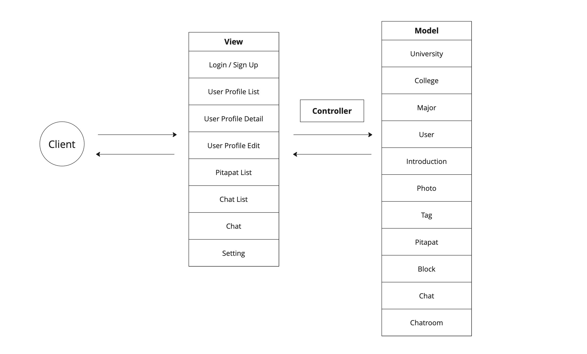

# Team 3 Final Report

**Woo Seungseok, Kim Hyein, Choi Seongwoo, Choi Moonone**

## Introduction

### Project Abstract

*Pitapat Campus* is a service setting up dates for college students on the same campus. Any college students trying to find a partner on their campus can use this service. Compared with other dating services, *Pitapat Campus* checks users’ registrations through email authentication and allows users to explore candidates only in the same university.
Users should sign up and log in to use the features of the services. Email authentication is required to create an account; a user proves one's registration by providing a college email address (ex. @snu.ac.kr) and checking the verification code. After filling up basic information, including pictures, and adding tags, users can log in and access to main features: exploring profiles, exchanging “pitapat”, and chatting.
Users can look at others' profiles in the search tab and send pitapat as an expression of affection for attractive mates. When receiving pitapat, the user can examine the requestor's profile and accept or reject the call. After granting the request, a private chatting room between matched users is opened and the pair can exchange messages.
Since dating service is more appropriate for mobile, a user interface for mobile devices is designed priorly. There are four main views: search, request list, chatting list, and profile setting. Users can access each main view by pressing the corresponding icon in the navigation bar.

### Target Customers

Due to the COVID-19 pandemic, college students lost the chance to get to know people in real life. Being campus mates (a.k.a CC, Campus Couple) has become much harder, so college students started to find their mates online. As a result, the "dating" board in Everytime, an online university community service, has been vitalized.
*Pitapat Campus* will meet the demand to find boyfriends or girlfriends in the same college online. Students who want to be campus mates will use this software.
The customers will read this document when they want to know the overall features of the service or the purposes of the developers.

### Competitive Landscape

*Pitapat Campus* has two types of competitors. Firstly, dating apps such as Tinder and Amanda are one of the competitor types. These universal dating applications may be attractive to customers who want to get to know people in arbitrary fields. However, they are not good options for users who want to find their partner in a specific group.
Secondly, online university community services like Everytime are often used as dating platforms. Students who want to meet people in the same university can explore self-introduction posts on Everytime's "dating" board. This method hardly allows people to consider others’ appearance, one of the most important factors in choosing a potential sweetheart because most users do not upload their pictures on a public board. Furthermore, there are some irrelevant threads on the board that make the board's reputation bad.
Compared to competitive services, *Pitapat Campus* provides an efficient method to choose one's partner in the same college community based on users' profiles, including pictures, tags, and self-introduction. Matched users can continue communication through one-to-one chatting.

## Design

### User Stories

#### Signing Up

- actor: a university student who wants to use Pitapat Campus
- precondition: The user is on the login page.
- trigger: The user clicks the sign-up button.
- scenarios
  - The user selects their own university.
  - The mail domain is fixed, and the user enters the email, authentication mail is sent to the corresponding email.
  - Authentication is completed when the user checks the authentication mail and enters the verification code.
  - The user sets the password, and an account is created.
- postcondition: The corresponding account is created.
- exceptions
  - The email already exists in user database.
  - The authentication mail is sent, but the user does not check it in time.
  - The password is not strong.
- acceptance tests
  - (1)
    - given: a valid email
    - when: pushes confirm button
    - then: authentication mail is sent to the corresponding email
  - (2)
    - given: already-existing email
    - when: pushes confirm button
    - then: alert that the email already exists, and stay on that page
  - (3)
    - given: authentication mail is sent
    - when: user enters the verification code
    - then: proceed to the password setting step
  - (4)
    - given: authentication mail is sent
    - when: it is incorrect verification code or the time is over
    - then: alert that verification code is wrong or the available time has passed, and re-send authentication mail to guide the user sign up

#### Creating a Profile

- actor: a user who finished sign-up
- precondition: The user only finished email authorization.
- trigger: User's email is authorized but the user does not have profiles.
- scenarios
  - A user finishes email auth at the email-auth page.
- postcondition: The user will have a profile.
- exception: There are some required fields not filled.
- acceptance tests:
  - (1)
    - given: valid inputs
    - when: pushes submit button
    - then: a user profile is made.
  - (2)
    - given: some necessary fields are not filled
    - when: pushes submit button
    - then: alert the user that necessary fields are not filled

#### Updating a Profile

- actor: a user who finished sign-up
- precondition: User should have their profiles.
- trigger: The user pushes “change profile” button.
- scenarios
  - The profile-update page looks like the user-info page, but the user can update each profile element.
  - Every profile element could be updated, but required fields should not be empty.
  - After the user finishes update and click the “confirm” button, the user profile is updated.
- postcondition: User will have an updated profile.
- exceptions
  - Tries to make required field empty.
- acceptance tests:
  - (1)
    - given: valid inputs
    - when: pushes submit button
    - then: the user profile is updated
  - (2)
    - given: some necessary fields are updated as empty value
    - when: pushes submit button
    - then: alert the user that necessary fields are not filled

#### Sending Pitapat to Others

- actor: a user who find out other impressive users
- precondition: Pitapat sender and receiver are not yet matched.
- trigger: The user presses “pitapat” button on the profile page.
- scenarios
  - The user search page contains other users’ basic information such as a nickname, main profile image, and age.
  - The user can see the profile detail of the others by clicking the others’ main profile image.
  - The user sends a request by pressing the pitapat button.
- postconditions
  - The receiver can check the pitapat on the list of Pitapats page.
  - The sender’s pitapat button became already-sent state.
- acceptance tests:
  - (1)
    - given: a receiver did not block a sender
    - when: the sender pushes pitapat button
    - then: pitapat alarm is sent to the receiver

#### Seeing the List of Pitapats from Others

- actor: a user who gets a pitapat alarm
- precondition: A sender has sent pitapat to other user.
- trigger: The user presses a pitapat icon on the navigation bar.
- scenarios
  - The list of Pitapats page contains the sender’s basic information such as a nickname, main profile image, and age.
  - The user can see the profile detail of the sender by clicking the sender’s main profile image.
  - The user can press an accept button, which is under the sender’s profile image, or refuse the request by pressing “Refuse” button.
- postconditions
  - After matching up, they both can see others on the chat room list and the pitapat element should be disappeared from the list.
  - After pressing “Refuse”, the pitapat element disappears from the list, and there is no additional chat room
- exception: The user is matched with nobody.
- acceptance tests:
  - (1)
    - given: after receiving Pitapats from others
    - when: when the user check a received Pitapat and press receive button to exchange Pitapats
    - then: both users get matched up successfully and they both can see others on chat room list page
  - (2)
    - given: after receiving Pitapats from others
    - when: when the user check a received Pitapat and press the button to refuse
    - then: there is no matching up

#### Seeing the List of Pitapats Sent to Others

- actor: a user who sent pitapats to others.
- precondition: A User has sent pitapats to other users.
- trigger: The user presses a pitapat icon on the navigation bar and clicks  the 'pitapats sent list' tab.
- scenarios
  - The list of Pitapats sent to others contains the receiver’s basic information such as a nickname, main profile image, and age.
  - The user can see the profile detail of the sender by clicking the receiver’s main profile image.
  - The user can cancel a pitapat by clicking the pitapat button which is already toggled on.
- postconditions
  - After canceling a pitapat, the received user's profile is removed from the list.
- acceptance tests:
  - (1)
    - given: after sending Pitapats to others
    - when: when the user checks a sent Pitapat and presses the pitapat button to cancel
    - then: a received user is removed from the list, and the user is removed from the received pitapats list of the other user who just got canceled

#### Entering the Chat Room List Page

- actor: a user who has completed profile information
- precondition: The user has signed in.
- trigger: The user presses a “chatting” icon on the navigation bar.
- scenarios
  - The page contains a list of chat rooms with matched users.
  - Each chatting list element shows matched user's name, profile picture, and recent message with him or her.
  - When pressing the element, the user can move into an 1:1 chatting page with that user.
- postconditions
  - Pressing element of some matched user in the list: move into an 1:1 chat room view with him or her.
- exception: The user is matched with nobody.
- acceptance tests:
  - (1)
    - given: the user is in chat room list page
    - when: the user presses a chat room element
    - then: 1:1 chat room with him/her appears
  - (2)
    - given: the user is in the chat room list page
    - when: the user receives a message from some matched user
    - then: the preview message is updated

#### 1:1 Chatting with Matched User

- actor: a user who is matched with some other user
- precondition: Two users are matched through exchanging pitapat.
- trigger: The user presses an element in the chat room list.
- scenarios
  - At the upper part of the view, the profile picture of the counterpart is shown. When pressing the name or the profile picture, the user can see the profile or him or her.
  - The user can see sent or received messages with the counterpart at the center of the view. A speech bubble with messages points right if it contains a sent message, and points left with a received message. Message dispatch time is shown by the side of each speech bubble.
- exception: The user tries to send an empty message.
- acceptance tests:
  - (1)
    - given: the message input field contains a non-empty message
    - when: the user presses the send button
    - then: the message is sent and a speech bubble containing the message is added at the bottom of messages
  - (2)
    - given: the user is in the 1:1 chat room
    - when: the message input field is empty
    - then: the button is disabled
  - (3)
    - given: the user is in the 1:1 chat room with a matched user
    - when: the user receives a message from the counterpart
    - then: a speech bubble containing the message is added at the bottom of messages

### System Architecture

#### MVC Design Pattern

*Pitapat Campus* uses the Model-View-Controller design pattern in system architecture. The frontend contains 8 views, the backend has 11 models, and the controller connects the frontend and the backend.

#### Model

##### E-R Diagram

Each table represents an entity or a relationship between entities. Entity tables and relationship tables are distinguished by their prefixes: `E_` and `R_`.

A Line between two tables shows their relationship. Its relationship type is denoted as arrow shape and line color; these symbols are explained below the figure.

##### Entity Description

| Model            | Description                                                                                                                                   |
|------------------|-----------------------------------------------------------------------------------------------------------------------------------------------|
| **University**   | A closed community that only users in the same university can see each other.                                                                 |
| **College**      | Each university has a number of colleges.                                                                                                     |
| **Major**        | Each college in a university has a number of majors. Used as a user's tag.                                                                    |
| **User**         | The user that belongs to a university. Has its own introduction, photos, and tags. Can see profiles of other users and send pitapats to them. |
| **Introduction** | Self-introduce text written by a user.                                                                                                        |
| **Photo**        | Photos showing a user's appearance.                                                                                                           |
| **Tag**          | Additional keywords that a user adds to appeal itself.                                                                                        |
| **Pitapat**      | A request for matching from a user to another user.                                                                                           |
| **Block**        | A request for blocking from a user to another user.                                                                                           |
| **Chat**         | A Chat record contains chatroom key value, message, and sender.                                                                               |
| **Chatroom**     | A Chatroom has relationship with two matched users.                                                                                           |  

### View

The image below is the user interface for view design.

#### UI Flow

The functionality and the requirement for each page are described below.

#### Sign In Page (`/signin/`)

- Get 'e-mail' and 'password' and check whether the user is a member. After logging in, navigate to the main page.
- First visitors should click the sign-up button and make an account. Should navigate to the sign-up page.

#### Sign Up Page (`/signup/`)

- Get university information and e-mail address.
- Certify the user's university by receiving the code which is sent to the e-mail address.
- Get a username and check whether it already exists.
- Get information about birthday and year.
- Get information about the major, sex, and sexual orientation.
- Select tags that represent the user.
- Write a self-introduction.
- Upload pictures of the user.

#### Search Page (`/search/`)

- Show the list of users.
- Pictures and the username of each user are shown.
- User list can be filtered by colleges, majors, and tags.
- If a user clicks a picture, navigate to the user-detail page.

#### User Detail Page (`/profile/`)

- Information about the user is shown.
- A user can click a ‘pitapat’ button to send a ‘pitapat’.
- A user can block a specific person by clicking a 'block' button.
- If navigated from the ‘pitapats received list’, there is a ‘Refuse’ button for refusing.
- If navigated from the ‘pitapats sent list’, a ‘pitapat’ button is already toggled, and it can be canceled.

#### Chat List Page (`/chat/`)

- Show the list of chatting.
- Badges represent unseen massages numbers.
- If a user clicks a chatting room, navigate to the chat-detail page.

#### Chat Detail Page (`/chat/:encrypted/`)

- This is similar to Kakao Talk chatting room implementation.

#### Pitapat List Page (`/pitapat/`)

- There are ‘pitapats received list’ and ‘pitapats sent list’ tabs.
- On the ‘pitapats received list’, a user can see other users who sent pitapats to the user.
- On the ‘pitapats sent list’, a user can see other users to whom the user sent pitapats.
- If a user clicks a picture, navigate to the user detail page.

#### Setting Page (`/setting/`)

- A user can navigate to this page, from the chat list page, and the pitapats list page by clicking a setting button located in the top right corner.
- A user can fix the settings of this service.
- If a user clicks his/her profile picture at the top of the page, a user can fix his/her profile.
- A user can delete account.
- A user can manage block list.

## Implementation

### Sprint Timeline

| Sprint   | Tasks                                        |
|----------|----------------------------------------------|
| Sprint 1 | Requirements and specification               |
| Sprint 2 | Design and planning                          |
| Sprint 3 | Frontend implementation                      |
| Sprint 4 | Backend implementation & FE-BE communication |
| Sprint 5 | Additional features & deployment             |

### Frontend Implementation

For frontend implementation, *Pitapat Campus* used React.js with Redux. Tailwind CSS framework and Material UI components are adopted to realize UI design with better productivity. For testing, behavior-driven React Testing Library is used based on Jest framework.

#### Pages & Components

| Page            | Components                                                                                                                                                                                                                                                                                                                                                              |
|-----------------|-------------------------------------------------------------------------------------------------------------------------------------------------------------------------------------------------------------------------------------------------------------------------------------------------------------------------------------------------------------------------|
| `SignIn`        |                                                                                                                                                                                                                                                                                                                                                                         |
| `SignUp`        | - `UniversitySelect`   - `AlertModal`   - `InformationInput` - `EmailVerification`   - `AlertModal`   - `InformationInput` - `PersonalInformation`   - `AlertModal`   - `InformationInput` - `TagSelect`   - `TagElement` - `Introduction` - `ImageUpload`   - `AlertModal`   - `ImageUploadIcon` |
| `Search`        | - `AppBar` - `NavigationBar` - `Profile`   - `PitapatButton` - `UserFilter`   - `UserFilterElement`                                                                                                                                                                                                                                            |
| `ProfileDetail` | - `AppBar` - `PhotoSlider` - `PitapatButton`                                                                                                                                                                                                                                                                                                                  |
| `PitapatList`   | - `AppBar` - `NavigationBar` - `PitapatReceived`   - `Profile` - `PitapatSent`   - `Profile`                                                                                                                                                                                                                                                   |
| `ChatList`      | - `AppBar` - `NavigationBar` - `ChatListElement`                                                                                                                                                                                                                                                                                                              |
| `ChatDetail`    | - `AppBar` - `ChatBox`                                                                                                                                                                                                                                                                                                                                             |
| `Setting`       | - `AppBar` - `LoginInfoChanger` - `RemoveAccount` - `BlockedUserList`   - `BlockedUserElement`                                                                                                                                                                                                                                                      |
| `ProfileEdit`   | - `AppBar` - `PhotoSlider` - `EditButton` - `CollegeMajorEdit`   - `InformationInput` - `TagsEdit`   - `AlertModal`   - `TagElement` - `IntroEdit` - `PhotosEdit`   - `ImageUploadIcon`                                                                                                                               |

#### Redux Slices

##### `user` Slice

- states
  - `loginUser`: user who logged in
  - `users`: user list in search page
  - `searchPageIndex`: page number in search page
  - `nextPageUrl`: next page number in search page
  - `filter`: user filter in search page
  - `interestingUser`: other user showed in profile detail page
  - `pitapat`
    - `senders`: pitapat sender list in pitapat list page
    - `receivers`: pitapat receiver list in pitapat list page
  - `blocked`: blocked user list
  - `chat`
    - `participants`: chatting participant user list in chat list page
  - `piatpatListTabIndex`: tab index(received/sent) in pitapat list page
- reducers
  - `fetchSignIn`: sign in at backend server, get session token and `sessionid` cookie
  - `fetchSignOut`: sign out at backend server
  - `fetchSignUp`: send new user information to backend server
  - `getUsers`: get user list by filter
  - `getUser`: get a user data
  - `getLoginUser`: get a login user data
  - `getPitapatSenders`: get pitapat sender user list
  - `getPitapatReceivers`: get pitapat receiver user list
  - `getBlockedUsers`: get blocked user list
  - `getChatParticipants`: get chatting participant user list
  - `setFilter`: set user filter
  - `setPitapatListTabIndex`: set tab index(received/sent) in pitapat list page
  - `deleteSender`: delete pitapat sender in user list
  - `deleteReceiver`: delete pitapat receiver in user list
  - `deleteUser`: delete blocked user in user list
  - `addUser`: add a user at first in user list

##### `university` Slice

- states
  - `universities`: university list
- reducers
  - `getUniversities:` get university list

##### `college` Slice

- states
  - `colleges`: college list
- reducers
  - `getColleges`: get college list in a university

##### `major` Slice

- states
  - `majors`: major list
- reducers
  - `getMajorsByCollege`: get major list in a college
  - `getMajorsByUniversity`: get major list in a university

##### `tag` Slice

- states
  - `tags`: tag list
- reducers
  - `getTags`: get tag list

##### `chat` Slice

- states
  - `chatrooms`: chatroom list
  - `chatSockets`: chatroom WebSocket list
- reducers
  - `getChatrooms`: get chatroom list
  - `setChatroomEmpty`: reset chatroom list and sockets
  - `setSocket`: add new WebSocket connection
  - `setChatroomChats`: set chats in chatroom
  - `addChat`: add a chat in chatroom

### Backend Implementation

Django is chosen as a backend server framework. For convenience in implementation, Django REST Framework is used to construct RESTful APIs. Asynchronous WebSocket connection for chat service is implemented using Python Channels library. Basic text data is stored in MariaDB, and image sources are saved in Amazon S3. Test codes used Python UnitTest module.

#### API List

| Model            | API                                        | GET                                           | POST                                    | PUT                            | DELETE                                                        |
|------------------|--------------------------------------------|-----------------------------------------------|-----------------------------------------|--------------------------------|---------------------------------------------------------------|
| **University**   | `/university/`                             | get universities                              | X                                       | X                              | X                                                             |
| **College**      | `/college/university/<int:university_key>` | get colleges of a university                  | X                                       | X                              | X                                                             |
| **Major**        | `/major/college/<int:college_key>`         | get majors of a college                       | X                                       | X                              | X                                                             |
|                  | `/major/university/<int:university_key>`   | get majors of a university                    | X                                       | X                              | X                                                             |
| **User**         | `/auth/email/`                             | X                                             | receive email to send verification code | X                              | X                                                             |
|                  | `/auth/verify/`                            | X                                             | check email verification code           | X                              | X                                                             |
|                  | `/auth/login/`                             | X                                             | log in                                  | X                              | X                                                             |
|                  | `/auth/logout/`                            | X                                             | log out                                 | X                              | X                                                             |
|                  | `/user/exist/<str:email>`                  | check email is already exist                  | X                                       | X                              | X                                                             |
|                  | `/user/`                                   | get users                                     | create new user                         | X                              | X                                                             |
|                  | `/user/<int:key>/`                         | get a user and its introduction, photos, tags | X                                       | edit a user                    | delete a user and its introduction, photos, tag relationships |
| **Introduction** | `/user/<int:user_key>/introduction/`       | X                                             | X                                       | edit an introduction of a user | X                                                             |
| **Photo**        | `/photo/user/<int:user_key>/`              | X                                             | create new photo                        | X                              | X                                                             |
|                  | `/photo/<int:key>/`                        | get a photo                                   | X                                       | X                              | delete a photo                                                |
|                  | `/user/<int:user_key>/photo/`              | get photos of a user                          | X                                       | X                              | X                                                             |           
| **Tag**          | `/tag/`                                    | get tags                                      | X                                       | X                              | X                                                             |
|                  | `/user/<int:user_key>/tag/`                | X                                             | create user-tag relationships           | X                              | delete user-tag relationships                                 |
| **Pitapat**      | `/pitapat/`                                | X                                             | create new pitapat                      | X                              | delete a pitapat                                              |
|                  | `/user/<int:user_key>/pitapat/from/`       | get pitapats from a user                      | X                                       | X                              | X                                                             |
|                  | `/user/<int:user_key>/pitapat/to/`         | get pitapats to a user                        | X                                       | X                              | X                                                             |
| **Chatroom**     | `/chatroom/<int:chatroom_key>/user/`       | get user list in a chatroom                   | X                                       | X                              | X                                                             |
|                  | `/user/<int:user_key>/chatroom/`           | get chatroom list of a user                   | X                                       | X                              | X                                                             |
| **Block**        | `/block/`                                  | X                                             | create new block                        | X                              | delete a block                                                |
|                  | `/user/<int:user_key>/block/`              | get block list of a user                      | x                                       | X                              | x                                                             |

#### WebSocket Connection

- `ChatConsumer`
  - `connect`: add an appropriate group in channel layer and send past messages in the group
  - `disconnect`: discard a group in channel layer
  - `receive`: send received message in a group

## Testing

### Unit Testing
Both the frontend and backend test coverage recorded more than 90%, so the overall test coverage recorded 92%. We used various external libraries such as MUI for frontend and websocket for chat, but we thought that part was very intricate or insignificant to test, so we tried to raise the testing coverage of other parts.

#### Frontend

#### Backend

## Deploy

First of all, the Pitapat Campus is deployed on AWS EC2. The frontend consists of React. Its status is kept by Redux. The backend is implemented by Django. We also used Django Rest Framework for development convenience.

Nginx works as a web server proxy. It intermediates requests between the user, frontend, and backend. In the middle of Nginx and the backend, there are uWSGI and Daphne. uWSGI handles WSGI like HTTP requests, and Daphne handles ASGI, like web sockets, and it uses Redis for higher performance.

AWS S3 is used for file storage, and AWS RDS(MariaDB) is used for the DB system.

The feature below shows our workflow.

## Conclusion

During the semester, we want to make a new dating platform for college students. In terms of software, we want to build a mobile-friendly web app. Building a mobile app with React was quite interesting and challenging. There were no other options since what we have learnt and shared for frontend was React. This challenge let us learn the details of React. Making Pitapat Campus with Android or Swift could be a new good project. We cannot dismiss talking about Django. It was an interesting and powerful framework. Django’s support such as ImageField was very convenient, but we regret that we couldn't fully use Django admin because we made our own database, not delegating it to Django to migrate, so it has some conflicts with admin and auth.

The hardest part was the deployment. It was difficult to find where is the problem. Is it because of Django, uWSGI, Nginx, or React? Even an EC2 environment could be a cause. If it was a logical problem of code, then could test it, but it wasn’t. We had to try it manually, It consumed lots of time. It makes us aware of the importance of docker and official documents.

Documentation is the most interesting part. It is easy to underestimate, not a part of development. However, it performs as a beacon when we had to implement complicated things and prevents us to do unnecessary things. I think solid documentation is a key feature of TDD.

The test also required a lot of effort. In this project, we didn’t do TDD. Everything wasn’t fully defined, and we were in a hurry. 80% didn’t have a problem during implementation, but 20% was tricky. It consumed quite a big time than we expected. At that point, we could feel why we need TDD.

We could learn how the software development process is going. What we have learnt is not only just typing code but also coworking with team members. It was a great experience to develop software from A to Z. We could experience that partial work never tell us. I want to say thank you to our team members, TAs, and professor.
